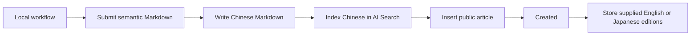

# my-knowledge

A personal knowledge publication that stores finished Chinese Markdown articles with summaries,
nested tags, and optional English and Japanese editions submitted by a local workflow.

## Processing flow

The local workflow produces semantic Markdown, then REST or MCP validates and stores it. Chinese is
written to R2 and AI Search before the public D1 row is committed. Optional English and Japanese
editions remain presentation-only R2 objects and never enter AI Search.



## Connect with MCP

Connect an MCP client using Streamable HTTP:

```json
{
  "mcpServers": {
    "my-knowledge": {
      "type": "streamable-http",
      "url": "https://knowledge.you-find.me/api/mcp",
      "headers": {
        "Authorization": "Bearer ${MY_KNOWLEDGE_API_KEY}"
      }
    }
  }
}
```

Sign in with the allowed email, then call `POST /api/settings/api-key` from that browser session and
save the returned key as `MY_KNOWLEDGE_API_KEY` in the environment used to start the client. The
plaintext is shown only in the rotation response. Some clients use a different syntax for
environment-variable expansion; in that case, follow the client's secret configuration format while
keeping the same endpoint and `Authorization: Bearer …` header. Keep the key secret because it grants
owner-level article access. The server accepts requests through `POST /api/mcp`. See
[MCP tools](docs/MCP.md), the [REST API](docs/API.md), and [Deployment](docs/DEPLOYMENT.md) for the
available operations, credential lifecycle, and Cloudflare resources.

`createArticle` accepts one complete Chinese Markdown document; it does not generate or translate
content. For a connection check, call `listTags` or `listArticles`; do not create a throwaway article.

## Local development

```text
pnpm install
cp apps/web/.env.example apps/web/.env.local
pnpm dev
```

Fill the local environment file before starting. For the production-like Worker workflow, migrations,
verification, and deployment, follow [Deployment](docs/DEPLOYMENT.md).

## Documentation

Start with the [documentation index](docs/README.md). Product behavior, architecture, content,
workflows, design, testing, and release instructions live under `docs/`.

## License

Apache-2.0. See [LICENSE](LICENSE).
