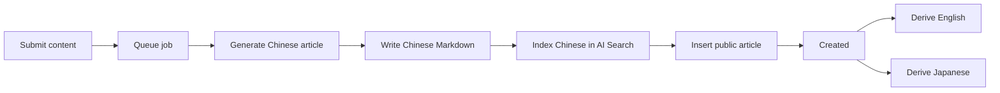

# my-knowledge

A personal knowledge publication that turns useful conversations in any language into finished
public Chinese Markdown articles with summaries, nested tags, and derived English and Japanese
translations.

## Processing flow

`createArticle` returns the future article ID immediately. The Queue consumer generates, validates,
stores, and indexes the public Chinese article first. Independent Queue messages add English and
Japanese translations afterward; translations never enter AI Search or block Chinese creation.



## Connect with MCP

Connect an MCP client using Streamable HTTP:

```json
{
  "mcpServers": {
    "my-knowledge": {
      "type": "streamable-http",
      "url": "https://knowledge.you-find.me/api/mcp",
      "headers": {
        "Authorization": "Bearer ${MCP_API_KEY}"
      }
    }
  }
}
```

Set `MCP_API_KEY` in the environment used to start the client. Some clients use a different syntax for
environment-variable expansion; in that case, follow the client's secret configuration format while
keeping the same endpoint and `Authorization: Bearer …` header. Keep the key secret because it grants
owner-level article access. The server accepts requests through `POST /api/mcp`. See
[MCP tools](docs/MCP.md) for the available operations and [Deployment](docs/DEPLOYMENT.md) for
configuring the key and Cloudflare resources.

`createArticle` queues Chinese writing plus two later translation calls. On a free Cloudflare plan,
call it serially; bursts can exhaust provider or platform allowances quickly. Check current limits in
the Cloudflare dashboard because this repository does not pin changing quota numbers. For a connection
check, call `listTags` or `listArticles`; do not use `createArticle` as a health check.

## Local development

```text
pnpm install
cp apps/web/.env.example apps/web/.env.local
pnpm dev
```

Fill the local environment file before starting. For the production-like Worker workflow, migrations,
verification, and deployment, follow [Deployment](docs/DEPLOYMENT.md).

## Documentation

Start with the [documentation index](docs/README.md). Product behavior, architecture, content,
workflows, design, testing, and release instructions live under `docs/`.

## License

Apache-2.0. See [LICENSE](LICENSE).
