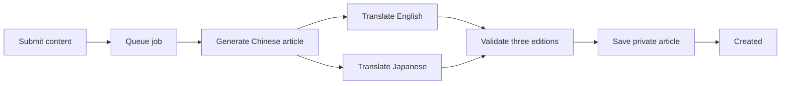

# my-knowledge

A private-first personal knowledge publication. It lets AI understand conversation content in any
language and turn it into a finished Chinese Markdown article with a summary, nested tags, and
English and Japanese editions. New articles are always private until the owner explicitly publishes
them.

## Processing flow

`createArticle` returns a job ID immediately. The Queue consumer generates the Chinese article,
translates English and Japanese concurrently, validates the three editions, and saves a new private
article. There is no pre-save duplicate lookup.



## Connect with MCP

Connect an MCP client using Streamable HTTP:

```json
{
  "mcpServers": {
    "my-knowledge": {
      "type": "streamable-http",
      "url": "https://knowledge.you-find.me/api/mcp",
      "headers": {
        "Authorization": "Bearer ${MCP_API_KEY}"
      }
    }
  }
}
```

Set `MCP_API_KEY` in the environment used to start the client. Some clients use a different syntax for
environment-variable expansion; in that case, follow the client's secret configuration format while
keeping the same endpoint and `Authorization: Bearer …` header. Keep the key secret because it grants
owner-level article access. The server accepts requests through `POST /api/mcp`. See
[MCP tools](docs/MCP.md) for the available operations and [Deployment](docs/DEPLOYMENT.md) for
configuring the key and Cloudflare resources.

`createArticle` runs the writing and translation models plus storage and search-index writes. On a free
Cloudflare plan, call it serially and wait for one creation to finish before starting the next; bursts
or concurrent creations can exhaust provider or platform allowances quickly. Check the current limits
in the Cloudflare dashboard because this repository does not pin changing quota numbers. To test the
connection without spending AI or Vectorize allowance, call `listTags` or `listArticles`; do not use
`createArticle` as a health check.

## Local development

```text
pnpm install
cp apps/web/.env.example apps/web/.env.local
pnpm dev
```

Fill the local environment file before starting. For the production-like Worker workflow, migrations,
verification, and deployment, follow [Deployment](docs/DEPLOYMENT.md).

## Documentation

Start with the [documentation index](docs/README.md). Product behavior, architecture, content,
workflows, design, testing, and release instructions live under `docs/`.

## License

Apache-2.0. See [LICENSE](LICENSE).
