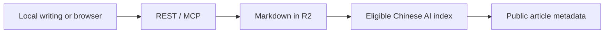

# my-knowledge

A personal blog and knowledge library built around content. Publish finished Markdown, read a quiet
chronological archive, and explore connections through search and a knowledge graph.

- **Focused reading:** narrow pages, responsive diagrams, shareable UUID links, and light/dark themes.
- **Expressive Markdown:** math, footnotes, repository cards, media, quotes, diffs, annotations, and
  architecture diagrams. Rich-text and source editing preserve supported content.
- **Owner controls:** browser authoring and visibility changes; anonymous readers see public articles.
- **Multilingual content:** canonical Chinese with optional English and Japanese editions.
- **Private AI search:** owner-only retrieval without storing questions, context, or generated answers.

## How it works

Next.js runs on Cloudflare Workers through OpenNext. R2 owns Markdown, D1 indexes metadata and
visibility, and KV caches derived data. Local tools produce content; the service validates and publishes it.



## Run locally

```sh
pnpm install
cp apps/web/.env.example apps/web/.dev.vars
pnpm dev
```

Configure `.dev.vars`, including `BETTER_AUTH_URL=http://localhost:8787`. Preview requires rebuilding
after edits. See [Deployment](docs/DEPLOYMENT.md) for bindings and secrets.

## Integrations

Connect MCP clients to `https://knowledge.you-find.me/api/mcp` with an owner-generated Bearer key.
See [MCP](docs/MCP.md), [REST API](docs/API.md), and the [documentation index](docs/README.md).

Apache-2.0 · [License](LICENSE).
