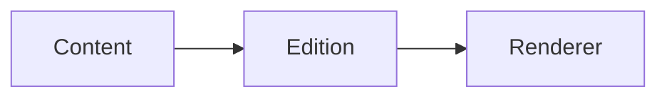

# Extensible Knowledge Boundaries

## Content model

> [!NOTE] A locale is one content dimension, not another article type.

The same article can connect to [[22222222-2222-4222-8222-222222222222|a related practice]] and preserve $x^2$.

```ts
const edition: string = "en";
```



## Data view

```vega-lite
{"$schema":"https://vega.github.io/schema/vega-lite/v6.json","data":{"values":[{"locale":"zh","count":1},{"locale":"en","count":1},{"locale":"ja","count":1}]},"mark":"bar","encoding":{"x":{"field":"locale","type":"nominal"},"y":{"field":"count","type":"quantitative"}}}
```

```json-canvas
{"nodes":[{"id":"content","type":"text","text":"Article","x":0,"y":0,"width":220,"height":100},{"id":"edition","type":"text","text":"Edition","x":320,"y":120,"width":220,"height":100},{"id":"renderer","type":"text","text":"Renderer","x":640,"y":20,"width":220,"height":100}],"edges":[{"id":"content-edition","fromNode":"content","toNode":"edition","label":"contains"},{"id":"edition-renderer","fromNode":"edition","toNode":"renderer","label":"presents"}]}
```

```embed:link
url: https://example.com/article
align: right
```

## Media playback

These silent fixtures demonstrate click-to-play media.

```embed:media
type: video
src: ./media-preview/video.mp4
title: Video preview
caption: A silent video with an automatic opening-frame preview.
```

```embed:media
type: audio
src: https://github.com/fixture/media/blob/main/media-preview/audio.mp3
title: Audio recording
caption: A silent recording for playback verification.
```

```embed:media
type: video
src: ./media-preview/video.mp4
poster: ./media-preview/cover.svg
title: Custom video
caption: A video with an explicit poster.
```
