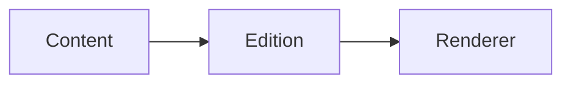

# 拡張可能な知識の境界

## コンテンツモデル

> [!NOTE] locale はコンテンツの一つの次元であり、別の記事型ではない。

同じ記事から [[related-article|関連する実践]] へ接続し、数式 $x^2$ も保持できる。

```ts
const edition: string = "ja";
```



## データビュー

```vega-lite
{"$schema":"https://vega.github.io/schema/vega-lite/v6.json","data":{"values":[{"locale":"zh","count":1},{"locale":"en","count":1},{"locale":"ja","count":1}]},"mark":"bar","encoding":{"x":{"field":"locale","type":"nominal"},"y":{"field":"count","type":"quantitative"}}}
```

```json-canvas
{"nodes":[{"id":"content","type":"text","text":"Article","x":0,"y":0,"width":220,"height":100},{"id":"edition","type":"text","text":"Edition","x":320,"y":120,"width":220,"height":100},{"id":"renderer","type":"text","text":"Renderer","x":640,"y":20,"width":220,"height":100}],"edges":[{"id":"content-edition","fromNode":"content","toNode":"edition","label":"contains"},{"id":"edition-renderer","fromNode":"edition","toNode":"renderer","label":"presents"}]}
```
