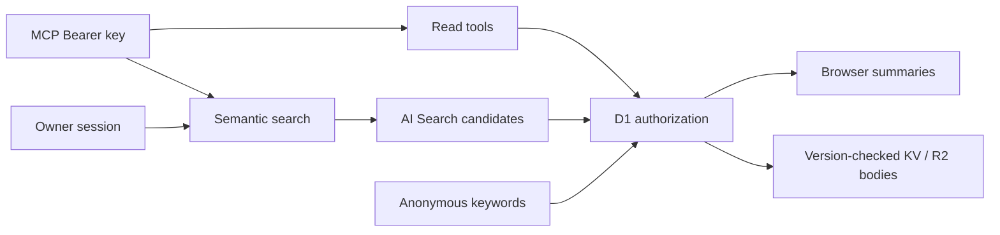

# Architecture

One Next.js application runs as one OpenNext Worker. Generation and translation run locally. `packages/content` owns schemas and Markdown semantics; `packages/ui` owns presentation. Web owns transports, operations and adapters. Dependencies point toward shared packages; domain code excludes adapters. One content-owned parser governs validation, links, editing and rendering.

ArticleWriter Durable Objects serialize each article's mutations and rollback. Only deletion markers are durable. R2 owns Markdown, D1 owns authorization, KV and AI Search are derived. AI Search manages chunking and embeddings; the application does not generate answers.

Social metadata always uses anonymous authorization; image responses remain no-store. Lists read metadata; links prefetch on intent. Better Auth verifies Google tokens and the allowed email. Cookie-free requests skip auth initialization; session checks are request-memoized. Only client IDs reach browsers. Mermaid, Vega and Canvas render in browsers; provider cards stream independently. [Database](DATABASE.md) owns persistence; [API](API.md) owns credentials.
