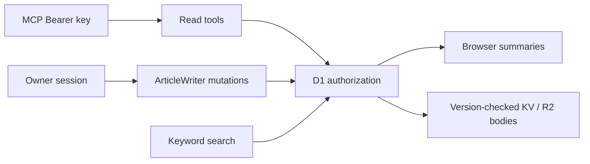

# Architecture

One Next.js app runs as one OpenNext Worker. Generation/translation run locally. `packages/content` owns schemas and the shared Markdown parser; `packages/ui` owns presentation. Web owns transports, operations and adapters, depending on shared packages.

ArticleWriter Durable Objects serialize mutations and rollback; only deletion markers are durable. R2 owns Markdown, D1 owns authorization and metadata, and KV is derived.

Social metadata uses anonymous authorization; images remain no-store. Lists read summaries; links prefetch only on intent. Better Auth lazily initializes per isolate; cookie-free checks skip initialization; sessions memoize per request. Pages/APIs enforce authorization; browsers receive client IDs. Locale and authorization keep pages dynamic.

Public Markdown uses bounded LRU before KV. Concurrent misses share reads, compilation and writes; hits skip parsing, highlighting and KaTeX. Metadata deduplicates per request/principal. Authorization and provider cards remain request-scoped; private articles bypass artifact KV. Card providers declare URLs, parsing and caching; shared transport bounds time, size and redirects. Mermaid, Vega and Canvas render in browsers. [Database](DATABASE.md) owns retention; [API](API.md) owns credentials.
