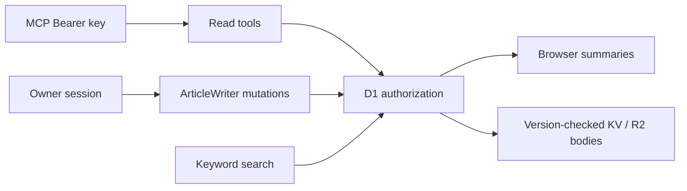

# Architecture

One Next.js application runs as one OpenNext Worker. Generation/translation run locally. `packages/content` owns schemas and the shared Markdown parser; `packages/ui` owns presentation. Web owns transports, operations and adapters; dependencies point toward shared packages.

ArticleWriter Durable Objects serialize mutations and rollback; only deletion markers are durable. R2 owns Markdown, D1 owns authorization and metadata, and KV is derived.

Social metadata uses anonymous authorization; images remain no-store. Lists read summaries; links prefetch on intent. Better Auth lazily initializes per isolate; cookie-free checks skip initialization and sessions memoize per request. Server pages and APIs enforce authorization; only client IDs reach browsers. Locale and authorization keep pages dynamic.

Public Markdown rendering checks versioned KV artifacts before compilation. Misses parse once and lazily initialize highlighting; isolates share pending compilations. KV hits restore validated trees without Markdown parsing, highlighting or KaTeX compilation. Authorization and streamed provider cards remain request-scoped; private articles bypass artifact KV. Mermaid, Vega and Canvas render in browsers. [Database](DATABASE.md) owns retention; [API](API.md) owns credentials.
