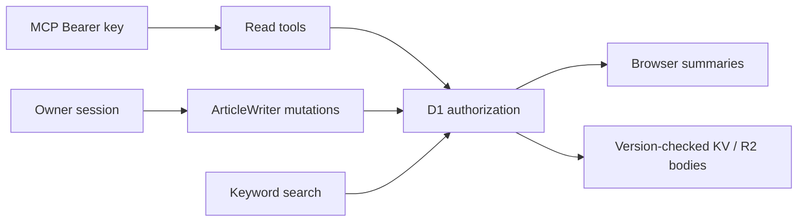

# Architecture

One TanStack Start app runs as one Cloudflare Worker through the Cloudflare Vite plugin. Generation/translation run locally. `packages/content` owns schemas and the shared Markdown parser; `packages/ui` owns presentation. Web owns transports, operations and adapters, depending on shared packages.

ArticleWriter Durable Objects serialize mutations and rollback; only deletion markers are durable. R2 owns Markdown, D1 owns authorization and metadata, and KV is derived.

```mermaid
flowchart LR
  MCP[MCP Bearer key] --> Read[Read tools]
  Owner[Owner session] --> Write[ArticleWriter mutations]
  Read --> D1[D1 authorization]
  Write --> D1
  Search[Keyword search] --> D1
  D1 --> Summary[Browser summaries]
  D1 --> Body[Version-checked KV / R2 bodies]
```

Social metadata uses anonymous authorization; images remain no-store. Lists read summaries; links prefetch only on intent. Better Auth lazily initializes per isolate; cookie-free checks skip initialization; sessions memoize per request. Pages/APIs enforce authorization; browsers receive client IDs. Route loaders call server functions; locale and authorization keep pages dynamic. Client loader data stays fresh for a minute; Article data never refreshes in the background, so streamed embeds do not flash. The header follows the rendered route, not the pending location.

Public Markdown uses bounded LRU before KV. Concurrent misses share reads, compilation and writes; hits skip parsing, highlighting and KaTeX. Metadata deduplicates per request/principal. Authorization and provider cards remain request-scoped; private articles bypass artifact KV. Card providers declare URLs, parsing and caching; shared transport bounds time, size and redirects. Loaders stream compiled trees and pending provider cards; Mermaid, Vega and Canvas render in browsers. [Database](DATABASE.md) owns retention; [API](API.md) owns credentials.

The Worker entry (`src/server.ts`) serves cookieless `GET /` and `GET /articles/{id}` documents from the edge Cache API. Keys add the resolved interface locale, the Worker version ID (cached HTML names hashed build assets) and a D1 version: the public article's `updatedAt`, or the article count and latest `updatedAt` for Home. Saves, visibility changes and deletions change the version, so withdrawn or deleted articles never match a cached document.
